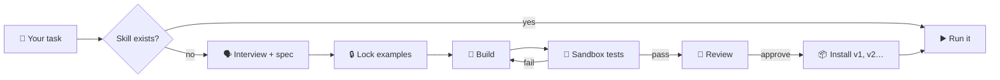

<div align="center">

# 🧟‍♂️ Frankenstein Agent

**An AI agent that builds the tools it's missing.**

*Ask it something it can't do. It stitches together a new skill, shocks it to life in a sandbox,
lets a reviewer check it for monsters, and only then lets it walk.*


</div>

---

## 💡 The idea

AI agents are great until they hit something they have no tool for. Then they improvise, and improvised
code runs straight on your machine.

**Frankenstein does it differently.** When a skill is missing, it:

1. 🔍 **Spots the gap**: *"I can't validate Czech company IDs yet."*
2. 🗣️ **Interviews you** in plain language, no jargon, and writes a short spec plus input/output examples.
3. 🔒 **Locks the examples** once you say *"yes, that's right"*. They become the source of truth, and the agent can't
   change them later to make its tests pass.
4. 🧪 **Builds and tests** the skill in a locked-down Docker container with no network, a read-only filesystem and no
   secrets.
5. 🧐 **Gets a second opinion** from an independent reviewer agent.
6. 📦 **Installs it** as a versioned [Agent Skill](https://docs.claude.com/en/docs/agents-and-tools/agent-skills),
   committed and tagged by a GitHub bot.
7. ✅ **Finishes your original task** with the new skill and reports what it cost.



## 🛡️ Why you can trust the monster

Prompts *ask* the agent to behave. **Code makes it.** Every rule below is enforced by Claude Code hooks, and they fail
closed.

| 🧷 Rule                                                   | ⚙️ How it's enforced                                                                                                                                                               |
|-----------------------------------------------------------|------------------------------------------------------------------------------------------------------------------------------------------------------------------------------------|
| Generated code never runs on your machine                 | Shell guard blocks interpreters and other ways to run skill code outside the sandbox                                                                                               |
| Your files reach a skill read-only, as paths              | Read-only sandbox mount (offline unless a listed API is needed), secrets refused; not reading your files is prompt-only: the PRD agent samples the first lines to learn the format |
| Locked examples stay locked                               | sha256 lock and a file guard                                                                                                                                                       |
| No install without green tests **and** an approve verdict | The install script re-checks the lock hash, the review and a fresh test run                                                                                                        |
| Budget can't run away                                     | Caps on builder iterations and USD spend per run                                                                                                                                   |
| Only a human can disable, roll back or remove a skill     | Those commands are blocked for the agent                                                                                                                                           |
| Every GitHub write is traceable                           | Commits, tags and issues come from a GitHub App bot (in local mode: `frankenstein-bot`, never your git identity)                                                                   |

There's even a **deterministic audit** (`/audit`) that replays the session transcript and proves **0 host executions**.

## 🚀 Quick start for judges

No GitHub App key and no `.env` needed: a fresh clone runs end to end in **local mode**.

Requires **Node.js 24**, **Docker** (running) and **Claude Code** with your own account.

```sh
git clone https://github.com/ddb-vr/frankenstein.git && cd frankenstein
npm install
npm run sandbox:build     # build the Docker sandbox image
claude                    # start Claude Code in the repo root
```

Then try our demo case on the synthetic data in [`demo/data/`](demo/data): a Czech bank export (windows-1250) and a
list of issued invoices. Use the exact prompts in [`demo/tasks.md`](demo/tasks.md), each in a fresh session:

1. *"Which of my invoices have been paid and which haven't?"* No skill does that yet: it asks you a few questions,
   builds, tests, reviews and installs a payment-matching skill, then answers.
2. *"Which customers have owed me money for more than 30 days? Please draft payment reminders."* It finds the first
   skill, builds only the reminder part on top of it, and answers for a fraction of the cost.

Prepared answers to its questions are in [`demo/answers.md`](demo/answers.md), the expected results in
[`demo/answer-key.md`](demo/answer-key.md). If the skills from our recording are already installed, start from zero
with `npm run demo:reset -- --yes` (in local mode it only commits locally; nothing is pushed). Afterwards look at
`npm run skills -- list`, the new commits and tags in `git log --oneline --decorate -3` and the build issues in
`tracker/issues/`.

### Tracker modes

Picked automatically from the environment or `.env` ([`.env.example`](.env.example)); each run logs the one it uses.

- **github-app**: `GITHUB_APP_ID`, `GITHUB_APP_PRIVATE_KEY_PATH`, `GITHUB_APP_INSTALLATION_ID` set: GitHub issues,
  commits, tags and pushes as our bot.
- **pat**: else `GH_TOKEN` and `GITHUB_REPO` set: the same GitHub issues as your token's user; commits and tags stay
  local.
- **local**: otherwise: issues in `tracker/issues/<n>.md`; commits and tags local as `frankenstein-bot`, nothing pushed.

Proof of the full GitHub integration: the
bot's [build issues](https://github.com/ddb-vr/frankenstein/issues?q=label%3Askill-build) (each closed with a cost table
and sandbox audit) and the [skill version tags](https://github.com/ddb-vr/frankenstein/tags) in our public repo.

## 🎛️ You stay in control

```sh
npm run skills -- list              # what has the monster built?
npm run skills -- show <name>       # history, versions, cost
npm run skills -- rollback <name>   # back to the previous version
npm run skills -- disable <name>    # put it back in the lab
```

## 📚 Want the gory details?

All the internals (skill contract, hook rules, audit, registry and known limitations) are in
**[docs/TECHNICAL.md](docs/TECHNICAL.md)**.

## 👥 Authors

Made with ⚡ and too much coffee by

- **Vít Rozsíval**, [mail@vitrozsival.cz](mailto:mail@vitrozsival.cz)
- **Dai Duong Bui**, [lukasbui2005@gmail.com](mailto:lukasbui2005@gmail.com)

<div align="center"><sub><i>"It's alive!" 🧟‍♂️⚡</i></sub></div>
