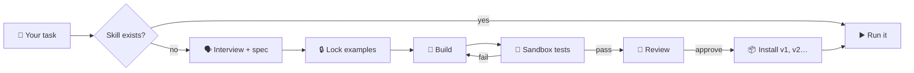

<div align="center">

# 🧟‍♂️ Frankenstein Agent

**An AI agent that builds the tools it's missing.**

*Ask it something it can't do. It stitches together a new skill, shocks it to life in a sandbox,
lets a reviewer check it for monsters, and only then lets it walk.*


</div>

---

## 💡 The idea

AI agents are great until they hit something they have no tool for. Then they improvise, and improvised
code runs straight on your machine.

**Frankenstein does it differently.** When a skill is missing, it:

1. 🔍 **Spots the gap**: *"I can't validate Czech company IDs yet."*
2. 🗣️ **Interviews you** in plain language, no jargon, and writes a short spec plus input/output examples.
3. 🔒 **Locks the examples** once you say *"yes, that's right"*. They become the source of truth, and the agent can't
   change them later to make its tests pass.
4. 🧪 **Builds and tests** the skill in a locked-down Docker container with no network, a read-only filesystem and no
   secrets.
5. 🧐 **Gets a second opinion** from an independent reviewer agent.
6. 📦 **Installs it** as a versioned [Agent Skill](https://docs.claude.com/en/docs/agents-and-tools/agent-skills),
   committed and tagged by a GitHub bot.
7. ✅ **Finishes your original task** with the new skill and reports what it cost.



## 🛡️ Why you can trust the monster

Prompts *ask* the agent to behave. **Code makes it.** Every rule below is enforced by Claude Code hooks, and they fail
closed.

| 🧷 Rule                                                   | ⚙️ How it's enforced                                                                                                                                                               |
|-----------------------------------------------------------|------------------------------------------------------------------------------------------------------------------------------------------------------------------------------------|
| Generated code never runs on your machine                 | Shell guard blocks interpreters and other ways to run skill code outside the sandbox                                                                                               |
| Your files reach a skill read-only, as paths              | Read-only sandbox mount (offline unless a listed API is needed), secrets refused; not reading your files is prompt-only: the PRD agent samples the first lines to learn the format |
| Locked examples stay locked                               | sha256 lock and a file guard                                                                                                                                                       |
| No install without green tests **and** an approve verdict | The install script re-checks the lock hash, the review and a fresh test run                                                                                                        |
| Budget can't run away                                     | Caps on builder iterations and USD spend per run                                                                                                                                   |
| Only a human can disable, roll back or remove a skill     | Those commands are blocked for the agent                                                                                                                                           |
| Every GitHub write is traceable                           | Commits, tags and issues come from a GitHub App bot                                                                                                                                |

There's even a **deterministic audit** (`/audit`) that replays the session transcript and proves **0 host executions**.

## 🚀 Quick start

```sh
npm install
cp .env.example .env      # GitHub App credentials + budget caps
npm run sandbox:build     # build the Docker sandbox
claude                    # then ask for something it can't do yet
```

Requires **Node.js ≥ 24.x** and **Docker**.

## 🎛️ You stay in control

```sh
npm run skills -- list              # what has the monster built?
npm run skills -- show <name>       # history, versions, cost
npm run skills -- rollback <name>   # back to the previous version
npm run skills -- disable <name>    # put it back in the lab
```

## 📚 Want the gory details?

All the internals (skill contract, hook rules, audit, registry and known limitations) are in
**[docs/TECHNICAL.md](docs/TECHNICAL.md)**.

## 👥 Authors

Made with ⚡ and too much coffee by

- **Vít Rozsíval**, [mail@vitrozsival.cz](mailto:mail@vitrozsival.cz)
- **Dai Duong Bui**, [lukasbui2005@gmail.com](mailto:lukasbui2005@gmail.com)

<div align="center"><sub><i>"It's alive!" 🧟‍♂️⚡</i></sub></div>
